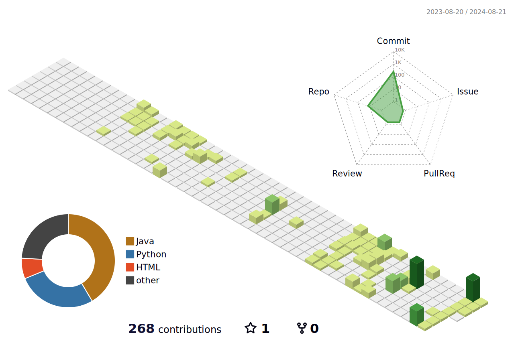

### Skills ⚒️

    <strong>Backend</strong>
    

        
        
    

    <strong>Database</strong>
    

        
<!--          -->
    

    <strong>middleware</strong>
    

        
        
        
    

    
    <strong>cloud</strong>
    

    

    <strong>etc</strong>
    

        
        
        
    

### Studying 📖

<!--

<!--
**Hojeong016/Hojeong016** is a ✨ _special_ ✨ repository because its `README.md` (this file) appears on your GitHub profile.

Here are some ideas to get you started:

- 🔭 I’m currently working on ...
- 🌱 I’m currently learning ...
- 👯 I’m looking to collaborate on ...
- 🤔 I’m looking for help with ...
- 💬 Ask me about ...
- 📫 How to reach me: ...
- 😄 Pronouns: ...
- ⚡ Fun fact: ...
-->
